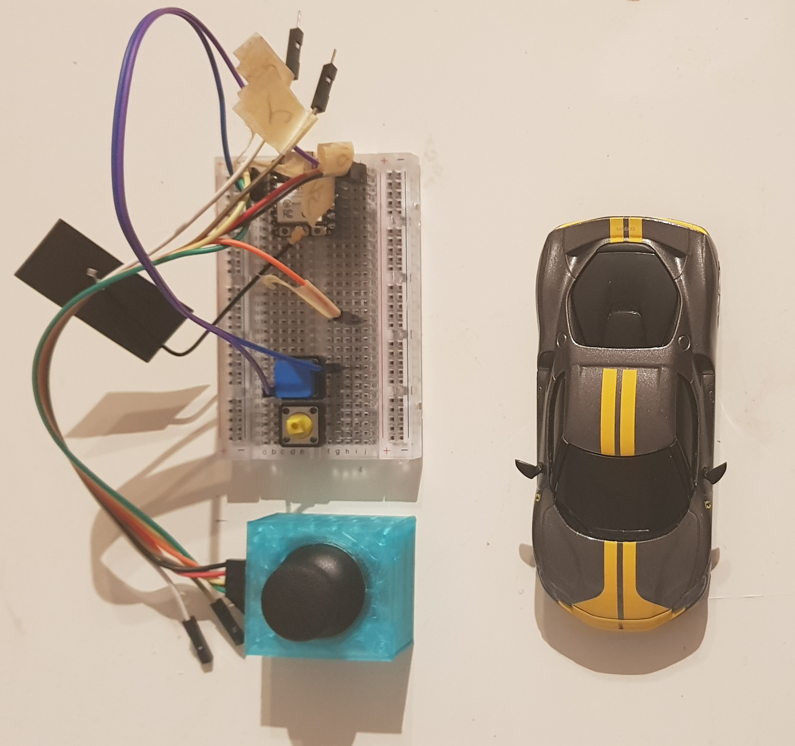
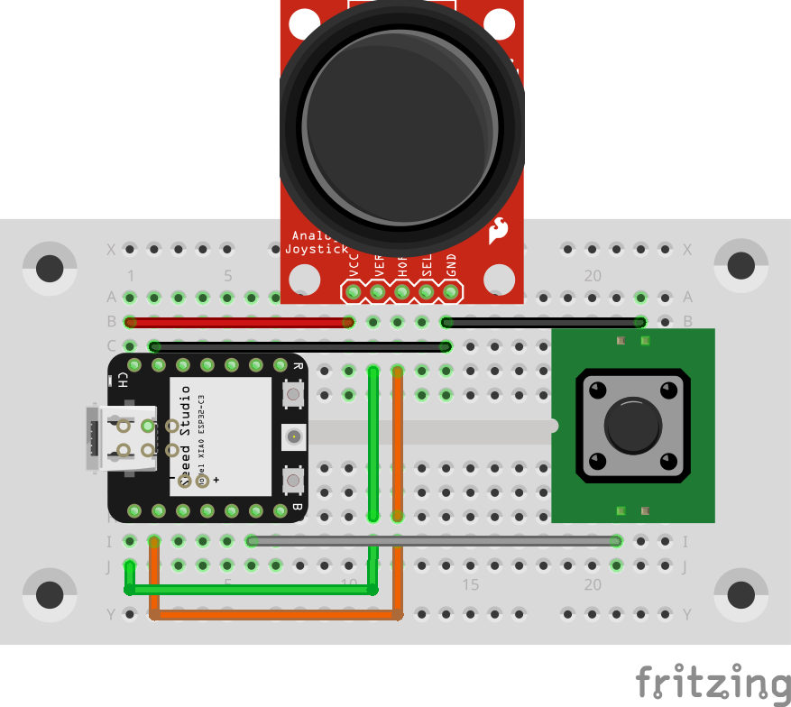

# Controller not from the SHELLf

This is my reimplementation of [This Project](https://github.com/jenkings/BLE-RC-Car-ESP32).  
And useful link may be also [this one](https://gist.github.com/scrool/e79d6a4cb50c26499746f4fe473b3768). Here is done reverse enginnering.

# Tools and parts

- Done using PlatformIO
- Works with Seeed Studio XIAO ESP32C3
- Uses Iduino ST1079 as controller (with [this case](https://www.thingiverse.com/thing:1162200))
- Simple tact switch for turbo

# Photo of my setup and connections

# NOTES!

This is simplified code from [This Project](https://github.com/jenkings/BLE-RC-Car-ESP32).  
It uses exactly UUIDs of BLE Charcteristics and other values that were needed in my case.  
I post my code because there are changes in how the code connects with Car.  
The code as is may not be useful for you, but you may find some inspiration to make original project work.

# Upload code

1. To upload code on your ESP32C3 you need to adjust `platformio.ini` with correct board.  
2. Then change `upload_port` and other parameters (if your board does not handle it)
3. Upload using `make upload` or copy paste command from there that uses PIO CLI.
